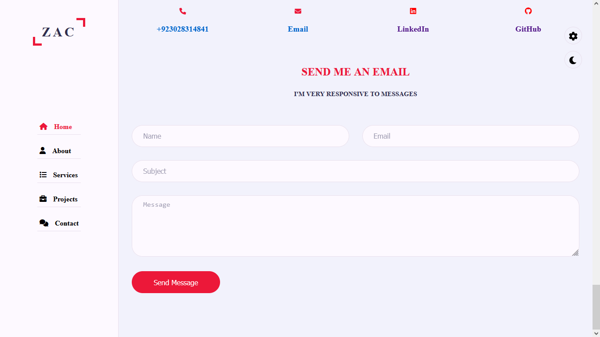

# Project: Personal Portfolio

## Project Details:
This is web project that I have made is "Personal Information Website". It is an interactive website with beautiful user-interface so that user can interact with it easily and take advantage of accessing a users personal information so that it will be easy for that person in making decision.

Following are the functionalities that this project provides to its users.
- Using this website, a person can look at the personal information and work that it done by that person make it.
- It has menus included in sidebar:  - Home - About - Services - Porfolio - Contact Details   

## Languages Used:
- HTML 
- CSS 
- JavaScript 
- Bootsrap

## Output:

## Instructions for Interactiving for Project:
In order to run your project and facilitates yourself with above mentioned services or functionalities, you simply need to download .project folder (from GitHub Repository) and then simply open index.html file in any browser. That's it.

Happy Coding!
